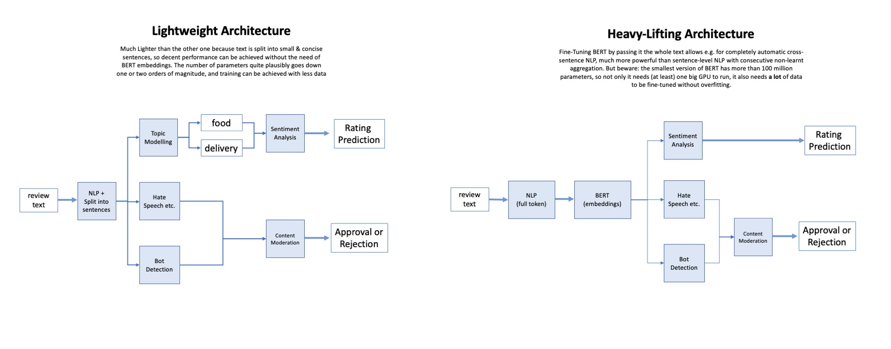
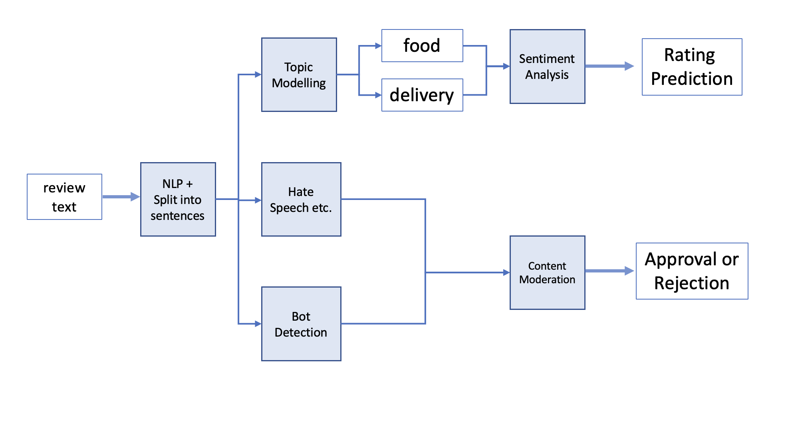
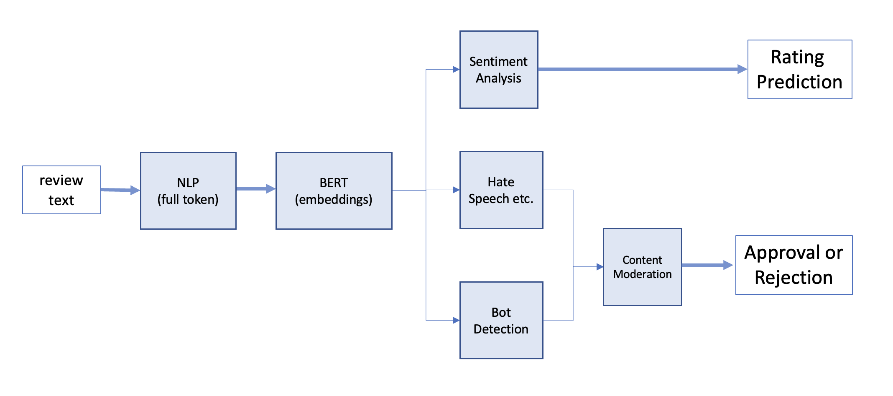
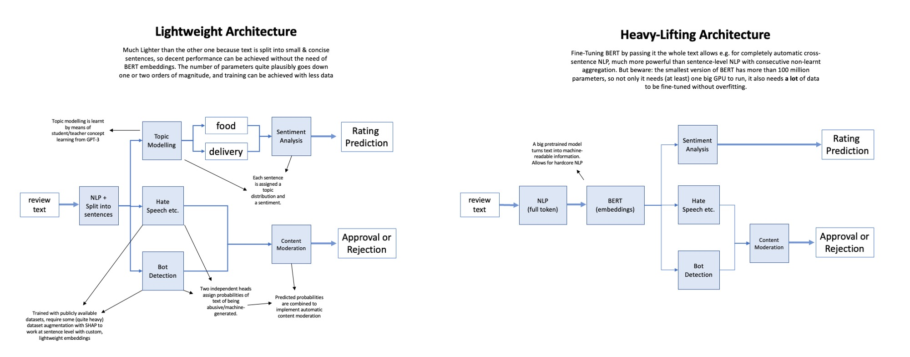
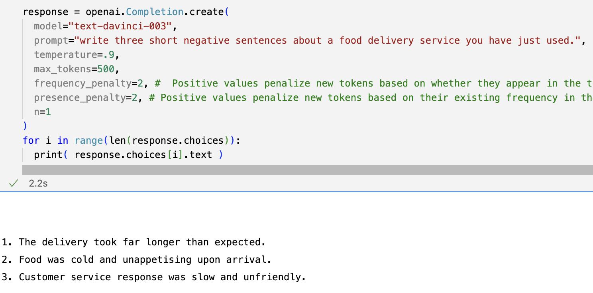

# Valerio Mariani - Assignment Geckosoft

# System Design

## introduction

Because the second point of the task mentions generating a mock dataset to train the model, I'm assuming I need to deal with a lack of task-specific data. It should be clear from the beginning tho, that all of this works much better if the company has a populated dataset with real reviews from its users.

In short, the following architectures are designed to try and maintain a baseline performance without any task-specific data, but would obviously work much better with lots of specifically engineered real data.

### problem 1
The main problem with generating data for this task, is that publicly available datasets for sentiment analysis **have one rating for one comment, while here we deal with two ratings for a single comment**, so the model needs to discern the concepts of "food" and "delivery service" and derive a sentiment measure for each of them.

### problem 2
Assuming we can teach a network to understand which parts of text refer to food quality and which others refer to delivery quality, a second problem is that publicly available, **annotated datasets that specifically treats delivery services for food are not really a thing right now**. This can be an issue because good delivery can be recognized by words that not necessarily are a good/bad thing for other services, e.g. if the network is trained on amazon delivery ratings, it probably doesn't know that delivering cold pizza can also be a symptom of a bad delivery service. Even if one uses a model that's trained on such a variety of tasks that generalization could be enough to obtain baseline results (at the cost of a lot of parameters) **fine-tuning the model with task-specific data** will mathematically produce more accurate results.

### proposed Solution/Architectures (Teacher/Student nets)
Good news is that an API for **GPT-3** is available, and it **can be used to generate very meaningful data**. Bad news is that generating an exaggerated amount of data with this method is economically expensive, so data generation and its exploitation needs to be very finely crafted.

Following are two architectures that constitute two ends of a spectrum of variations, each of which is a different **trade-off** between **risk** (quantity of data to be generated or collected to make the thing work) **performance**, and **computational cost**. 
The two architectures are:
- a **"Lightweight" architecture**, that uses some hard-coded NLP techniques to make the task much simpler, in such a way that less data and less parameters are required to achieve a decent classification performance. Note that this architecture won't be able to perform advanced inference. In example, single neural inferences are limited to the level of single sentences. Those inferences are then combined with hard-coded logical algorithms. Also note that with some little tweaks this architecture runs just fine at client-side (see Bonus task 1).
- a **"Heavy-Lifting" architecture** uses a Pre-Trained, state-of-the-art Transformer model that was specifically designed for NLP, is known as BERT, and is capable of much more powerful inference. The cost of that is that BERT stands on more than 100 million parameters to work, and requires **a lot** of data to be trained effectively.


Here is a little overview to anticipate what's coming. Detailed explanations are below.



## Lightweight Architecture

The lightweight architecture builds on the assumption that dealing with unitary sentences is easier than dealing with complete pieces of text, because each sentence is supposed to convey its own piece of semantical meaning. 

For example, rather than teaching a single network to take something like:
"pizza was tasty but it arrived late" 
and then
1) derive which part of the review talks about what
2) assign a sentiment to the part that talks about food
3) assign a sentiment to the part that talks about delivery

One can split the text in sentences without even needing a neural network, derive the topic of each sentence with a specialized tool (again, there is not even need for a neural network to do this) and then feed the tagged, unitary sentence to a relatively small, specialized neural network.
For example the text above could be splitted like:
["pizza was tasty ", "but it arrived late" ]
then tagged like:
[ ( "pizza was tasty ", "food" ), ( "but it arrived late", "delivery" ) ]
and finally, the two tagged sentences are fed into specialized neural networks to evaluate sentiment.

At this point - when the model is lucky enough that the sentences are semantically split like this - even a pre-trained neural network (that was trained on "general Sentiment Analysis") can come to the conclusion that the text is positive about food and negative about the delivery service. This is also known as "Zero Shot Learning" and is what I brought as an implementation. 

Obviously, in a situation in which I have more than two days to formulate a solution, I would fine-tune the pre-trained NN on the task at hand with GPT-3 data and, in an ideal situation, completing the dataset with real data from the client company.

Finally, note that - obviously - a model like this cannot understand complex, inter-sentence relationships, so in practice it will probably (for sure) perform (much) worst than a model that was trained with 10x parameters and data to derive meaning from much longer sequences of tokens.


Below are a visual representation of the architecture and an excursus on its functioning:



Using some standardized, mainly hard-coded, NLP techniques, the sentence is pre-processed to make it more machine-readable, and then split into sentences.

Then, for the rating prediction:
  1) each sentence is **assigned a distribution of topics**. e.g. 80% food, 10% delivery, 10% other. Topic Modelling is carried over with a technique know as Latent Dirichlet Allocation (LDA) that - to make it **extremely** short - builds on the fact that some words are very frequent when talking about certain topics, for example the word "pizza" usually appears when talking about food, while "delivery guy" appears more when talking about delivery services. To train the LDA model to learn two concepts **with supervision** it's easily enough to ask GPT-3 to generate some text about food and some text about deliveries. This approach can be seen as an instance of Teacher/Student learning. Another possible approach to topic-modelling would be to take inspiration from a model known as BERTopic (customize it but use a much smaller neural network. BERTopic library has primitives to do this) and train with a classification objective function, but it would probably be an overkill (shooting at flies with a cannon).
  2) Tagged, Unitary sentences are now **analysed to search for sentiment**. The neural Networks can be trained on general sentiment analysis with publicly available datasets, then by generating some fake reviews with GPT-3 it is possible to fine tune the net on the specific topic. In example, here we can train a network on a variety of sentiment analysis tasks, then generate 2/3 thousand fake reviews of food and complete the training by fine-tuning the model on the "food" topic.

For the Content moderation, we can e.g. train one model to classify malicious content and one to classify machine-generated content through publicly available datasets and then combine the results to monitor the quality of the text. 

In this case tho, before running the model at sentence level, it would probably be better to augment the dataset because, while you can ask GPT-3 to generate short reviews (e.g. one sentence reviews) publicly available dataset are used to map (text)->0/1 instead of (sent1->0/1, sent2->0/1 ...) so one possible approach would be to:
- train a model at text level
- use SHAP to identify which parts of each text sample contributes to the classification, i.e. which sentences
- save how much each sentence has contributed in the classification of a text sample as malicious (very intuitivelly, SHAP finds out how much the text is malicious if we remove certain pieces of information: if removing a piece makes a text sample pass from malicious to non-malicious, then that piece probably was malicious)
- you have basically increased the granularity of the supervision: now you know how much each sentence can be classified as malicious
After the augmentation, it is possible to train a smaller model at sentence level that detects malicious sentences instead of malicious reviews.

## Heavy-Lifting Architecture

In case data generation (or gathering data from the actual company) is not a problem - or even a combination of them is enough to reach at least some 10.000 training samples - a much more powerful approach would be to use the Heavy-Lifting Architecture: in this case, we have no sentence splitting whatsoever: the network can just be fed with the whole review and trained end-to-end to solve the different tasks. This modality need more data because there are many more parameters to train, and - explained in a very poor way - if you train a huge model with few data, the model overfits the training data.
In case you don't know, BERT is a large neural network that has been trained to produce usefull embeddings. That is, in very simple terms, turn words into vectors of numbers that are very machine-readable.

A visual representation of the architecture:



Now, training the heavy-lifting architecture needs a little more reasoning. The main question is whether or not we need to fine-tune BERT (embeddings). Fine-tuning BERT would probably yield  better performance, but it is much more expensive from the computational-power point of view.

In practice, in both situations we can just stack a Multi-Layer Perceptron over the BERT Network for each task (Sentiment Analysis, Bot Detection, Hate Speech etc.) but then we can:
1) just train the MLPs
2) also fine-tune BERT's parameters to improve the embeddings.

On a side note: this second case is the only one in which I would use pythorch isntead of tensorflow: while the other settings just require a very standard training algorithm (a one-liner in tensorflow) this setting involves training the same network (BERT) on different tasks, and this cannot be done "one task at a time" because you would incur in something known as Catastrophic Forgetting. So this means that you need to alter the training algorithm to learn all the tasks together, so pytorch is more suited because it is by design suited for custom training algorithms.

## System Design recap

So in summary, The lightweight architecture needs a lot less data & parameters but is less powerfull in terms of inference, while the Heavy-Lifting one is very powerful but requires much more effort and computational power to work. 

Honestly, there is a lot of possible variations in the middle - to cite one, exchanging BERT with a smaller embedding network lowers needed parametes and data but also performance -  and the final choice in my opinion should come from 1) at least some experimentation 2) a carefully crafted analysis of client company's requirements.

As for Generation/gathering of the task-specific review data, even if we have the company's data to train the model, augmenting the dataset with GPT-3 still seems like a decent idea.

Here's an annotated visual representation of the two architectures:


# Data Generation

As stated above, I identified two sources of data for training: one is publicly available datasets, the other is GPT-3 APIs.

To cite some publicly available dataset, we have:
1) For hate speech https://hatespeechdata.com/#English-header
2) For toxic comments https://www.kaggle.com/competitions/jigsaw-toxic-comment-classification-challenge
3) For Bot-generated content https://github.com/BunsenFeng/TwiBot-20 
4) For fake reviews https://osf.io/tyue9/
5) For Sentiment Analysis http://jmcauley.ucsd.edu/data/amazon/ https://nlp.stanford.edu/sentiment/code.html etc.

As for GPT-3 APIs, here's a screenshot with a sample generation:


# Integrating the System

The main ways that come to my mind to use this system outside its python implementation are:
- Deploying it and accessing it with a REST API over HTTP protocol: since parameters for the call plausibly are small pieces of text (reviews) and a few numbers, HTTP is easily enough to carry the parameters in the payload. Calling a REST API is possible in most programming languages. This can be done both from Frontend and from Backend. It can also be made more secure by communicating trough docker's private network (docker-compose) if the system fits the host machine (in this case, apposite docker images exist for the most common frameworks) otherwise the ML system would be hosted by any ML-specific Faas-like services like SageMaker 
- Another way to let applications written in different languages communicate between each other is by developing a command line interface, since most programming languages have some way of launching other processes via terminal. The calling process could work on call's parameters and outputs via apposite files.
- A third way would be to open sockets for communication between a process and the other.

# Implementation 
For a little demonstration of my idea, I brought a dumb version of the lightweight architecture. To mock the functioning of some possible real implementation, i mainly did:
- NLP pre-processing and sentence splitting with a very famous NLP library called spaCy   (split the sentence)
- written an extremely dumb version of LDA with pure python                               (topic modelling   )
- generated some text with GPT-3 to use my LDA for topic modelling                        (topic modelling   )
- Used a tool called textblob that comes with a pre-trained sentiment predictor.          (sentiment analysis)

Then I:
- took the whole algorithm and put in a route inside a flask service, 
- built an absolutely ugly frontend with react, 
- conteinerized the two of them

And now you should be able, from this directory to:
```bash
  docker-compose up --build
```
and after some time it should be possible to prompt the algorithm using the browser at http://localhost:3000 